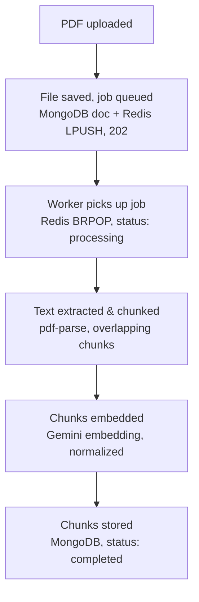
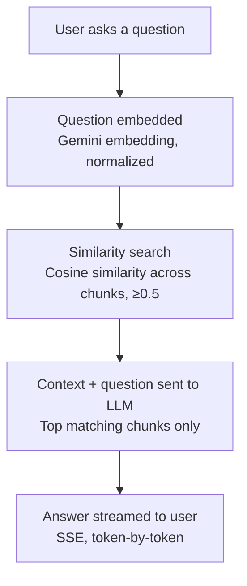

# AskPDF — RAG-based Document Q&A System

AskPDF lets a user upload a PDF and ask natural-language questions about it. Answers are generated using Retrieval-Augmented Generation (RAG), grounded strictly in the document's content, with real-time streaming responses.

## Tech Stack

**Backend:** Node.js, Express.js, MongoDB (Atlas + Atlas Vector Search-style manual retrieval), Redis (Upstash), Gemini API
**Frontend:** React (Vite), Axios, Fetch Streaming API
**Infra concepts:** Message queues, background workers, Server-Sent Events (SSE)

## Architecture

The system is split into two independent flows: **document processing** (happens once per upload) and **chat/query** (happens on every question).

### 1. Upload & Processing Pipeline



1. **PDF uploaded** — user selects a file in the UI and submits it.
2. **File saved, job queued** — Multer saves the file to disk, a `Document` entry is created in MongoDB with `status: pending`, a job is pushed onto a Redis queue (`LPUSH`), and the API immediately responds with `202 Accepted` plus a `documentId`. This keeps the upload request fast regardless of file size.
3. **Worker picks up job** — a separate, independently-running Node.js process (`worker.js`) blocks on the Redis queue (`BRPOP`) and picks up the job as soon as it's queued. Status is updated to `processing` in both MongoDB and Redis.
4. **Text extracted & chunked** — the PDF is parsed to raw text (`pdf-parse`), then split into overlapping chunks so that context isn't lost at chunk boundaries.
5. **Chunks embedded** — each chunk is sent to the Gemini embedding model (`gemini-embedding-001`), producing a 768-dimensional vector. Since the model only auto-normalizes at its full 3072-dimensional output, vectors are manually normalized to unit length so cosine similarity is accurate at the reduced dimension.
6. **Chunks stored** — each chunk, its embedding, and its position index are saved to MongoDB. The parent `Document` is marked `completed`, and an orphan-cleanup job periodically marks any document stuck in `processing` for too long (e.g. a crashed worker) as `failed`.

### 2. Chat / Query Pipeline



1. **User asks a question** — typed into the chat UI.
2. **Question embedded** — the question is embedded the same way as document chunks, then normalized.
3. **Similarity search** — cosine similarity is computed between the question's embedding and every chunk's embedding for that document. Only chunks above a tuned similarity threshold are kept, which is the system's main hallucination-mitigation step — if nothing is relevant, the model is told to say so instead of guessing.
4. **Context + question sent to the LLM** — the top matching chunks are joined into a context block and sent to Gemini along with the question and an instruction to answer only from that context.
5. **Answer streamed to the user** — the response is generated via `generateContentStream` and piped to the frontend over Server-Sent Events, so the answer appears token-by-token instead of all at once.

## Why a Redis Queue + Worker?

Processing a large PDF (parsing, chunking, and generating embeddings for every chunk) can take significant time. Doing this inside the upload request would block the API and risk timeouts on large files. Decoupling upload from processing means:

- The API responds instantly (`202 Accepted`) regardless of file size.
- Processing happens in a separate, independently scalable worker process.
- Multiple worker instances could run in parallel to handle more load.

## Folder Structure

```
askpdf/
├── backend/
│   ├── src/
│   │   ├── config/         # MongoDB + Redis connections
│   │   ├── models/         # Document, Chunk schemas
│   │   ├── routes/         # upload, chat, status endpoints
│   │   ├── controllers/    # request handlers
│   │   ├── services/       # pdfParser, chunker, embedder, vectorSearch, llmService, cleanupService
│   │   └── app.js
│   ├── worker/
│   │   └── worker.js       # background job processor + orphan cleanup
│   └── server.js
│
└── frontend/
    └── src/
        ├── components/      # UploadBox, ChatWindow
        ├── services/        # api.js — all backend calls
        └── App.jsx          # upload → polling → chat flow
```

## Setup

### Backend
```bash
cd backend
npm install
# create a .env file with:
# PORT=5000
# MONGO_URI=<your MongoDB Atlas connection string>
# REDIS_URL=<your Upstash Redis URL>
# GEMINI_API_KEY=<your Gemini API key>
npm run dev          # starts the API server
node worker/worker.js  # starts the background worker (separate terminal)
```

### Frontend
```bash
cd frontend
npm install
npm run dev
```

## Key Design Decisions

- **Manual embedding normalization** — `gemini-embedding-001` only normalizes automatically at its full 3072-dimensional output. Since this project uses 768 dimensions (to keep vectors compact), embeddings are manually L2-normalized before storage and comparison, which is required for cosine similarity to be meaningful at reduced dimensions.
- **Similarity threshold tuned empirically** — rather than assuming a fixed cutoff, the threshold was validated against real query/chunk pairs and adjusted to match the actual similarity range this embedding model produces.
- **Two chat endpoints** — a non-streaming endpoint was kept alongside the streaming one, since it made testing and debugging the retrieval logic easier in isolation before adding streaming complexity.
